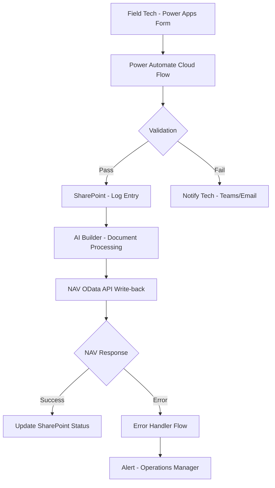

# Power Automate Flow Architecture — NAV Integration

## Overview

This document describes the end-to-end Power Automate cloud flow that connects field technicians using Power Apps to the backend Microsoft Dynamics NAV ERP system. The flow ensures data captured in the field is validated, logged to SharePoint, processed through AI Builder, and written back to NAV with full error handling and notification.

## Flow Diagram

## Flow Triggers

| Trigger | Type | Details |
|---|---|---|
| Power Apps form submission | Power Apps (V2) | Initiated when technician taps Submit on the mobile canvas app |
| Scheduled re-try | Recurrence (daily) | Checks for Failed entries in SharePoint and re-attempts NAV write-back |
| Manual trigger | Button flow | Available to Operations Manager for forced re-submission of flagged records |

## Action-by-Action Breakdown

| Step | Action | Connector | Description |
|---|---|---|---|
| 1 | Trigger — PowerApps (V2) | Power Apps | Receives WorkOrderNumber, TechID, CompletionDate, SiteAddress, PartsUsed, LaborHours, CustomerSignatureURL, JobNotes |
| 2 | Initialize variable | Variable | SuccessFlag (Boolean, default false) |
| 3 | Validate required fields | Condition | Check WorkOrderNumber and TechID are not empty; branch on fail |
| 4 | Notify tech on validation fail | Teams | Send adaptive card to technician Teams channel with error detail |
| 5 | Create SharePoint item | SharePoint | Write submission to FieldOps list with Status = Pending |
| 6 | Run AI Builder model | AI Builder | Process attached PDF/image; extract structured fields |
| 7 | Condition — confidence check | Condition | Route low-confidence extractions (<0.70) to review queue |
| 8 | HTTP POST to NAV OData | HTTP (Premium) | POST to `/ODataV4/Company('ACME')/WorkOrders` with OAuth bearer token |
| 9 | Parse NAV response | Parse JSON | Extract NAV record ID and HTTP status code |
| 10 | Condition — success check | Condition | Branch on HTTP 201 Created vs error codes |
| 11a | Update SharePoint status | SharePoint | Set Status = Completed, NAV_RecordID = returned ID |
| 11b | Set SuccessFlag | Variable | Set to true |
| 12 | Trigger error handler (child flow) | Flow | Pass error detail, WorkOrderNumber, timestamp to child error flow |

## Error Handling Patterns

The parent flow delegates error handling to a child flow (`FieldOps-ErrorHandler`) for separation of concerns and reusability.

**Child flow actions:**
1. Log error to SharePoint Error Log list (columns: Timestamp, WorkOrderNumber, Error Code, Error Message, FlowRunURL)
2. Send adaptive card to Operations Manager Teams channel with error summary and link to SharePoint log entry
3. Update parent SharePoint entry status to `Failed`
4. Retry NAV write-back up to 3 times using an Until loop with exponential backoff (30s, 60s, 120s)
5. If retries exhausted, set status to `Failed - Manual Review Required`

## Authentication Notes

- **NAV OData HTTP connector:** OAuth 2.0 using Azure AD app registration
  - App registration created in the production Azure AD tenant
  - Permissions: `Dynamics NAV` → `Financials.ReadWrite.All`
  - Client ID and client secret stored as Power Platform environment variables (never hardcoded in flows)
  - Token endpoint: `https://login.microsoftonline.com/{tenant_id}/oauth2/v2.0/token`
- **SharePoint connector:** uses the service account connection `svc-powerautomate@acme.com`
- **Teams connector:** uses the service account connection for all automated notifications
- **Connection references** are updated per environment during managed solution deployment — see `05-deployment-guide.md`
